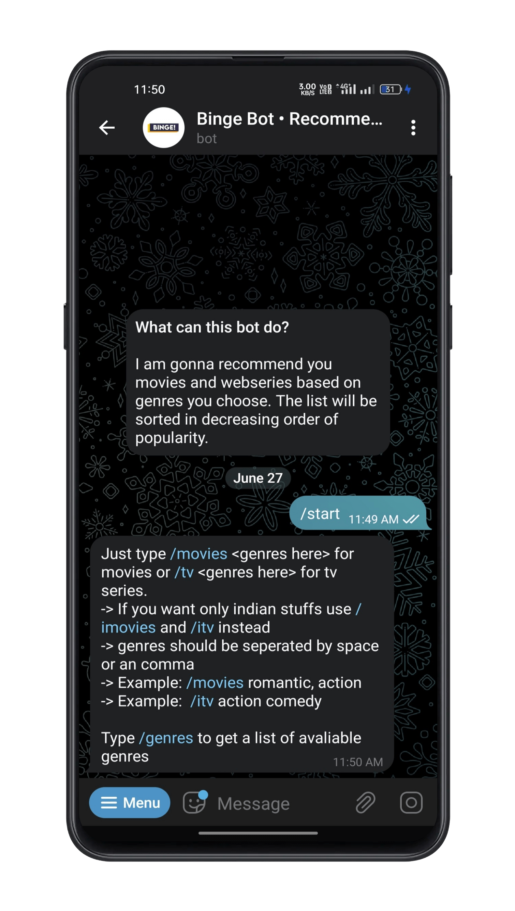
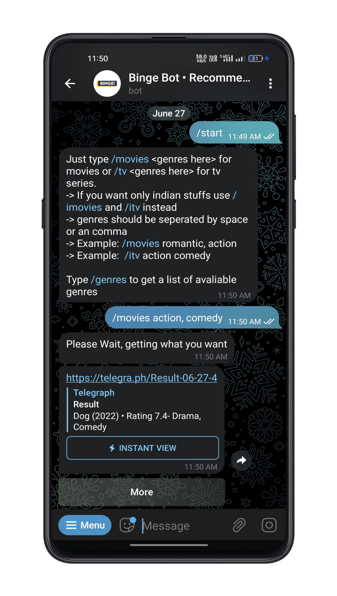
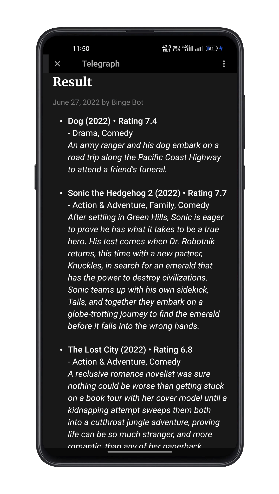
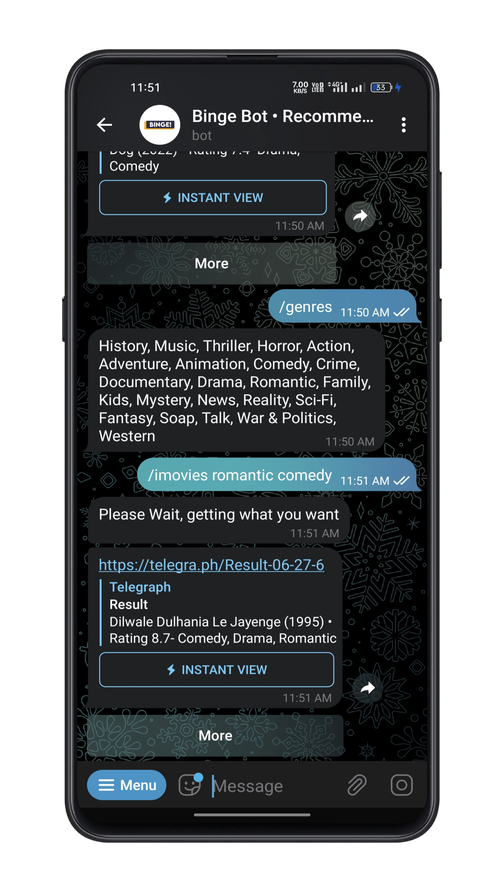

<h1 align="center">
  <b>Bing Bot</b>
   
</h1>

<h2 align="center">I can suggest movies and tv/web series to you based on genres and popularity</h2>
<h3 align="center">Try on <a href="https://t.me/binge1bot">https://t.me/binge1bot</a> </h3>

 

<h3 align="center"><b>Screenshots</b></h3>

 

This product uses the TMDb API but is not endorsed or certified by TMDb.

 

## **Features**
🔵 Multiple Genres Support

🔵 Fast enough

🔵 Instant View Pages as Result

🔵 Filter for Indian movies and webseries

🔵 Ratings and Overview 

 

## **Getting Started**
Head over to `.env` file and fill these details
 

`BOT_TOKEN = "Token-Here"` [Telegram Bot Token](https://core.telegram.org/bots#6-botfather)

`TMDB_API_KEY = "Key-Here"` [TMDB API Key](https://developers.themoviedb.org/3/getting-started/introduction)

`TELEGRAPH_TOKEN = "Token-Here"` [Telegra.ph API Token](https://telegra.ph/api#Account)

`SERVER_URL = "URL-here"` Ngrok, heroku or whatever

 

### **Installation**

`npm install` That's it :)

### **Usage**

`node app.js` Running the server

## **ToDos**

🔸 Torrent/TG link support

🔸 Filters

🔸 Sort Type

## **Credits**

▪ [The Movie Database](https://www.themoviedb.org/)

▪ [Telegra.ph API](https://telegra.ph/api)

▪ [Google](https://google.com)
